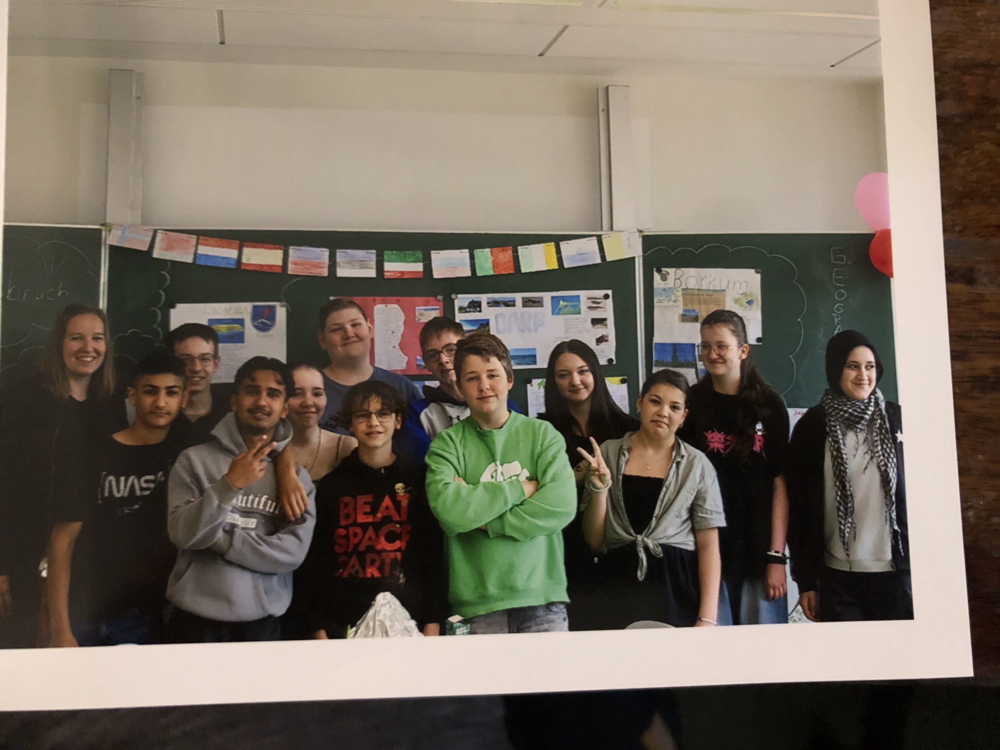
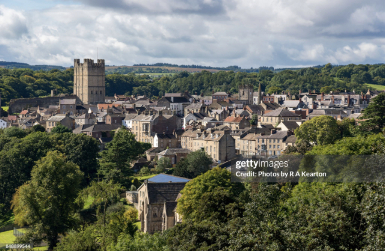
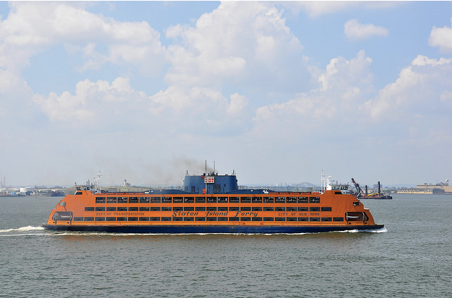

<html lang="en">
<head>
<meta charset="utf-8" />
<meta name="viewport" content="width=device-width, initial-scale=1" />
<title>Staten Island — Immersive Digital Poster</title>

<!-- Neue Schriftarten -->
<link href="https://fonts.googleapis.com/css2?family=Playfair+Display:wght@600;800&family=Nunito:wght@300;400;600;800&display=swap" rel="stylesheet">

</head>
<body>
<button class="toggle-dark" id="darkToggle">☀️ / 🌙</button>

  <header>
    
🗽

    

      <h1>Staten Island</h1>
      
The greenest borough of NYC — parks, history, and breathtaking harbor views.

    

  </header>

  <!-- Hero Image -->
  

  

    <section class="card attractions">
      <h2>Top Attractions ▼</h2>
      <ul class="list">
        <li>Staten Island Ferry offers a free ride across New York Harbor. → Die Staten Island Fähre bietet eine kostenlose Fahrt über den New Yorker Hafen.</li>
        <li>Snug Harbor Cultural Center & Botanical Garden showcase historic buildings and gardens. → Snug Harbor Cultural Center & Botanischer Garten zeigen historische Gebäude und Gärten.</li>
        <li>Historic Richmond Town presents colonial life with museums and live demonstrations. → Historic Richmond Town zeigt das koloniale Leben mit Museen und Vorführungen.</li>
        <li>Fort Wadsworth sits beneath the iconic Verrazzano-Narrows Bridge. → Fort Wadsworth liegt unter der berühmten Verrazzano-Narrows-Brücke.</li>
        <li>Staten Island Greenbelt offers over 2000 acres of parks and hiking trails. → Staten Island Greenbelt bietet über 2000 Hektar Parkflächen und Wanderwege.</li>
        <li>Staten Island Zoo features exotic animals and a reptile house. → Staten Island Zoo hat exotische Tiere und ein eigenes Reptilienhaus.</li>
      </ul>
    </section>

    <section class="card facts">
      <h2>Fast Facts ▼</h2>
      <ul class="list">
        <li>Nickname: “The Borough of Parks”. → Spitzname: „The Borough of Parks“.</li>
        <li>Todt Hill is the highest natural point in NYC (~125 m). → Todt Hill ist der höchste natürliche Punkt in NYC (~125 m).</li>
        <li>Verrazzano-Narrows Bridge connects Staten Island to Brooklyn. → Die Verrazzano-Narrows-Brücke verbindet Staten Island mit Brooklyn.</li>
        <li>Staten Island has 26 km of coastline. → Staten Island hat 26 km Küstenlinie.</li>
        <li>Staten Island is the greenest NYC borough with over 20% forest coverage. → Staten Island ist der grünste Bezirk NYCs mit über 20% Waldfläche.</li>
        <li>Snug Harbor was originally a home for retired sailors. → Snug Harbor war ursprünglich ein Heim für pensionierte Seeleute.</li>
      </ul>
    </section>

    <section class="card population">
      <h2>Population ▼</h2>
      
Approx. 495,747 (2020 Census), the least populous NYC borough. → Ca. 495.747 (Volkszählung 2020), der am wenigsten bevölkerte Bezirk NYCs.

    </section>

    <section class="card map">
      <h2>Where is it? ▼</h2>
      
Southwest of Manhattan, north of New Jersey, connected by bridges. → Südwestlich von Manhattan, nördlich von New Jersey, verbunden durch Brücken.

      <iframe width="100%" height="300" style="border:0" loading="lazy" src="https://www.openstreetmap.org/export/embed.html?bbox=-74.33%2C40.47%2C-74.02%2C40.67&amp;layer=mapnik&amp;marker=40.58%2C-74.14"></iframe>
    </section>

    <section class="card pictures">
      <h2>Pictures ▼</h2>
      

        
        
        
        
      

    </section>

    <section class="card movies">
      <h2>Staten Island in Film & TV ▼</h2>
      <ul class="list">
        <li>*The Irishman* (2019, Martin Scorsese) – scenes filmed on Staten Island. 
          → *The Irishman* (2019, Martin Scorsese) – Szenen wurden auf Staten Island gedreht.
        </li>
        <li>*War of the Worlds* (2005, with Tom Cruise) – includes Staten Island locations. 
          → *Krieg der Welten* (2005, mit Tom Cruise) – einige Szenen spielen auf Staten Island.
        </li>
        <li>*Goodfellas* (1990) – classic mafia film shot partly on Staten Island. 
          → *Goodfellas* (1990) – Mafia-Klassiker, teilweise auf Staten Island gedreht.
        </li>
        <li>*Working Girl* (1988, with Harrison Ford & Melanie Griffith). 
          → *Die Waffen der Frauen* (1988, mit Harrison Ford & Melanie Griffith).
        </li>
        <li>*Staten Island Summer* (2015, Netflix comedy). 
          → *Staten Island Summer* (2015, Netflix-Komödie).
        </li>
      </ul>
    </section>
  

<footer>✨ Erstellt von Marlon Leuchtmann & Paul Weisenbilder (8d) ✨</footer>

<button class="back-to-top" id="backTop">↑</button>

</body>
</html>
